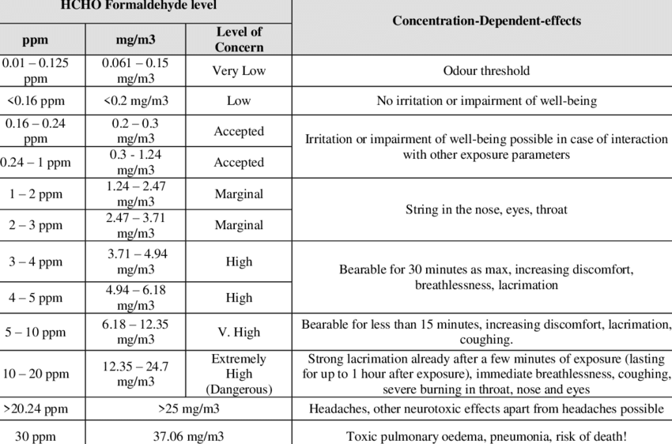

# 

# 

# 

# 

# 

**3d Print Air Quality Tests**

****Dany Veilleux****

# 

# 

# []{#anchor}****Introduction****

****I started my journey in 3D printing in January 2023 with an Ender 3
S1 that I replaced in May 2023 for a Bambu Lab X1C. In my learning
process, I started to be interested on the toxicity of the fumes that 3d
printing emits and I read some articles about this subject (See
reference below). Some research have been done but results are vague and
not clear options on how to improve the situation except for « being in
a well ventilated environment ».****

****Reference :****

-   [****https://all3dp.com/3d-printing-toxic-emissions-everything-need-know/****](https://all3dp.com/3d-printing-toxic-emissions-everything-need-know/)****
    ****
-   [****https://www.forbes.com/sites/mishagajewski/2020/12/15/3d-printers-may-be-toxic-to-humans/?sh=45c53bd94338****](https://www.forbes.com/sites/mishagajewski/2020/12/15/3d-printers-may-be-toxic-to-humans/?sh=45c53bd94338)****
    ****
-   [****https://3dsolved.com/is-3d-printing-toxic/****](https://3dsolved.com/is-3d-printing-toxic/)****
    ****

# []{#anchor-1}****Goal****

****My objective is to understand the toxicity with the different
filaments that I'm using and find behavior to improve the situation.
****

# []{#anchor-2}****Setup****

-   ****Bambu Lab X1C****

-   ****Sensor is a Stellate AQ-2000****

    -   ****I know this is not a high quality monitoring but should be
        good enough to give indications to achieve my goals. ****

-   ****Bento Box v 2.0****

    -   [****https://www.printables.com/model/272525-bentobox-v20-carbon-filter-for-bambu-lab-x1c-enclo****](https://www.printables.com/model/272525-bentobox-v20-carbon-filter-for-bambu-lab-x1c-enclo)

-   ****Room with a fan directing the air oustide****

# []{#anchor-3}**PLA **

## **Test **#1 - ****2023-08-26****

### **Printer Parameters**

-   ****PEI Texture plate****

-   ****Fan****

    -   ****Part = ****
    -   ****Aux = ****
    -   ****Chamber = ****

-   ****PolyLite Blue Silk****

****For a print that lasted 15 minutes****

+------------+------------+------------+-------+-------+-------+------+
| Status     | Sensor     | TVOC       | HCHO  | PM1.0 | PM2.5 | PM10 |
|            | location   |            |       |       |       |      |
+------------+------------+------------+-------+-------+-------+------+
| Before     | On the     | 0,252      | 0,036 | 001   | 003   | 004  |
| printing   | printer    |            |       |       |       |      |
+------------+------------+------------+-------+-------+-------+------+
| While      | On the     | *          |       | 001   | 003   | 004  |
| printing   | printer    | ***0,6**** |       |       |       |      |
+------------+------------+------------+-------+-------+-------+------+
|            | In the     | *          |       | 001   | 003   | 004  |
|            | enclosure  | ***4,5**** |       |       |       |      |
+------------+------------+------------+-------+-------+-------+------+
|            |            |            |       |       |       |      |
+------------+------------+------------+-------+-------+-------+------+
|            | In the     | ****9,999  | 0,844 | 001   | 003   | 004  |
|            | enclosure  | (****00h0  |       |       |       |      |
|            |            | 0****)**** | 0,811 |       |       |      |
|            |            |            |       |       |       |      |
|            |            | ****6,355  | 0,770 |       |       |      |
|            |            | (****00h1  |       |       |       |      |
|            |            | 5****)**** | 0,450 |       |       |      |
|            |            |            |       |       |       |      |
|            |            | ****6.00   | N/A   |       |       |      |
|            |            | (****00h2  |       |       |       |      |
|            |            | 5****)**** |       |       |       |      |
|            |            |            |       |       |       |      |
|            |            | ****5.9    |       |       |       |      |
|            |            | (****00h3  |       |       |       |      |
|            |            | 5****)**** |       |       |       |      |
|            |            |            |       |       |       |      |
|            |            | ****4,4    |       |       |       |      |
|            |            | (****01h1  |       |       |       |      |
|            |            | 4****)**** |       |       |       |      |
+------------+------------+------------+-------+-------+-------+------+

****

# []{#anchor-4}****PETG****

## **Test **#1 - ****2023-08-26****

### **Printer Parameters**

-   ****PEI Texture plate****

-   ****Fan****

    -   ****Part = 90%****
    -   ****Aux = 0%****
    -   ****Chamber = 70%****

-   ****Matreio3D White****

### **Measurements**

****For a print that lasted 15 minutes****

****I activated the Chamber Fan to 100% after the print****

****After 9 minutes, I activated the Aux Fan to 100%****

+-----------------+------------------+-----------------------+-------+-------+-------+------+
| Status          | Sensor location  | TVOC                  | HCHO  | PM1.0 | PM2.5 | PM10 |
+-----------------+------------------+-----------------------+-------+-------+-------+------+
| Before printing | On the printer   | 0,252                 | 0,036 | 001   | 003   | 004  |
+-----------------+------------------+-----------------------+-------+-------+-------+------+
| While printing  | On the printer   | ****0,****266****     | 0,04  | 001   | 003   | 004  |
+-----------------+------------------+-----------------------+-------+-------+-------+------+
|                 | In the enclosure | ****4,****620****     | 0,729 | 001   | 003   | 004  |
+-----------------+------------------+-----------------------+-------+-------+-------+------+
| After print     |                  |                       |       |       |       |      |
+-----------------+------------------+-----------------------+-------+-------+-------+------+
|                 | In the enclosure | ****6,227 (0h00)****  | 0,787 | 001   | 003   | 004  |
|                 |                  |                       |       |       |       |      |
|                 |                  | ****15h18****         | 0,729 |       |       |      |
|                 |                  |                       |       |       |       |      |
|                 |                  | ****4,620 (00h05)**** | 0,469 |       |       |      |
|                 |                  |                       |       |       |       |      |
|                 |                  | ****4,567 (00h09)**** | 0,287 |       |       |      |
|                 |                  |                       |       |       |       |      |
|                 |                  | ****1,462 (00h12)**** |       |       |       |      |
+-----------------+------------------+-----------------------+-------+-------+-------+------+
|                 | On the printer   | 0,768 (00h12)         | N/A   |       |       |      |
|                 |                  |                       |       |       |       |      |
|                 |                  | 0,476 (00h15)         | 0,066 |       |       |      |
+-----------------+------------------+-----------------------+-------+-------+-------+------+

****

# ****

# []{#anchor-5}****Quality Reference****

## []{#anchor-6}**TVOC Level mg/m3: Level of Concern**

-   Less than 0.3 mg/m3: Low
-   0.3 to 0.5 mg/m3: Acceptable
-   0.5 to 1 mg/m3: Marginal
-   1 to 3 mg/m3: High

Reference =
<https://tecamgroup.com/what-are-acceptable-voc-levels-in-the-air/>

## []{#anchor-7}****PM 2.5**** Level ****u****g/m3: Level of Concern****

  ---------------------- ------------------------------------------ -----------------------------------------
  Air quality category   PM~2.5 ~µg/m^3^ averaged over 1 hour~\ ~   PM~2.5~ µg/m^3^ averaged over 24 hours
  Good                     Less than 25                             Less than 12.5
  Fair                     25--50                                   12.5--25
  Poor                     50--100                                  25--50
  Very poor                100--300                                 50--150
  Extremely poor           More than 300                            More than 150
  ---------------------- ------------------------------------------ -----------------------------------------

****Reference =
****[****https://www.epa.vic.gov.au/for-community/environmental-information/air-quality/pm25-particles-in-the-air****](https://www.epa.vic.gov.au/for-community/environmental-information/air-quality/pm25-particles-in-the-air)****
****

## []{#anchor-8}****PM ****10 ****Level ug/m3: Level of Concern****

  ---------------------- --------------------------------------
  Air quality category   PM~10~ µg/m^3 ^averaged over 1 hour 
  Good                     Less than 40
  Fair                     40--80
  Poor                     80--120
  Very poor                120--300
  Extremely poor           More than 300
  ---------------------- --------------------------------------

****Reference =
****[****https://www.epa.vic.gov.au/for-community/environmental-information/air-quality/pm10-particles-in-the-air****](https://www.epa.vic.gov.au/for-community/environmental-information/air-quality/pm10-particles-in-the-air)****
****

## []{#anchor-9}****PM ****1.0 ****Level ug/m3: Level of Concern****

****With average PM1 concentrations across all 26 cities measured by
researchers at 42.5 µg/m**^**3**^**, study data suggested that emergency
room visits increased significantly for every rise in PM1 of 10
μg/m**^**3**^**, with effects lasting up to 2 days after the initial
spike in PM1 concentrations.****

****Rerence =
****[****https://www.iqair.com/us/newsroom/pm1****](https://www.iqair.com/us/newsroom/pm1)****
****

## []{#anchor-10}**HCHO**

{width="17.59cm"
height="11.629cm"}****Reference =
****[****https://www.researchgate.net/figure/HCHO-Formaldehyde-level-of-emissions-and-side-effect-in-ppm-mg-m3-Reference-Alsarrag_tbl2_339028205****](https://www.researchgate.net/figure/HCHO-Formaldehyde-level-of-emissions-and-side-effect-in-ppm-mg-m3-Reference-Alsarrag_tbl2_339028205)****
****
